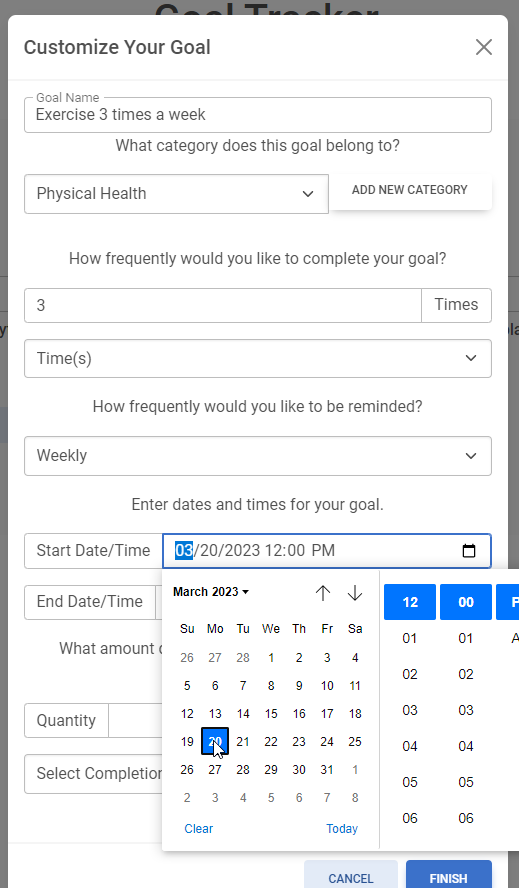

# Goal Tracker

[](https://opensource.org/licenses/MIT)

[Click here to go to the deployed site.](https://express-goal-tracker.herokuapp.com/)

## Description
Goal Tracker is a Node.JS/Express application for tracking personal goals.

## Table of Contents

1. [Description](#description)
2. [Installation](#installation)
3. [Usage](#usage)
4. [License](#license)
5. [Contributing](#contributing)
6. [Questions](#questions)

### Mock Up

The screenshot below shows the deployed site which shows it's various levels of functionality.
[](./assets/mockup.png)

[](./assets/add-goal.png)

## Installation
* Install Node.JS
* Run `npm install` to get dependencies
* Create an .env file in the root project folder with the information below
```
DB_NAME='xxx'
DB_PASSWORD='xxx'
DB_USER='xxx'
```
* Install Postgres on your server
* Run `CREATE DATABASE <DB_NAME_FROM_ENV_FILE>;` to create an empty database
* Run `npm start` to start the server
* Interact with different API calls in your browser or API tool such as Postman or Insomnia

## Usage

Since this site is deployed via Heroku, usage is simply done by going to the deployed app and creating a new account. 

## License

[](https://opensource.org/licenses/MIT)

This project is licensed under the MIT license.

## Contributing

To contribute to this repository, simply create a pull request, create issues, or reach out to us (see [Questions](#questions) below). We do our best to ensure that pull requests are up to date. 

## Questions

If you have any questions, reach out to me through either of the methods below:
- [GitHub - J03B](https://github.com/J03B/)
- [email - (byucrazyfan@gmail.com)](mailto:byucrazyfan@gmail.com)
- [GitHub - dhoneck](https://github.com/dhoneck/)
- [email - (honeck_34@hotmail.com)](mailto:honeck_34@hotmail.com)
